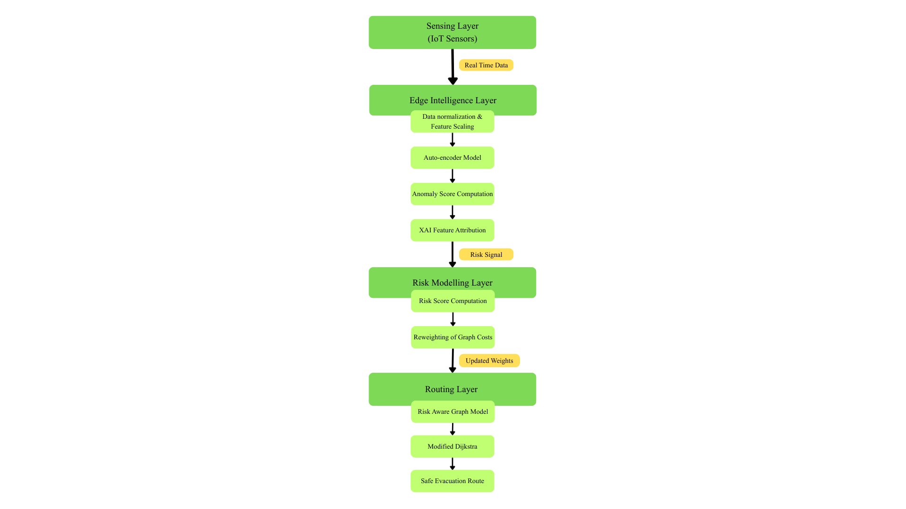

# ResQOS – T. Nagar Risk-Aware Routing

This repository contains a Python prototype for **ResQOS**, a lightweight AI-based system that computes risk-aware evacuation routes in T. Nagar, Chennai.

---

## Features

- Extracts drivable road network from OpenStreetMap using OSMnx  
- Integrates multi-hazard data (water level, crowd density, rainfall, light)  
- Computes risk scores for each road segment using a fuzzy logic approach  
- Performs risk-aware shortest path routing using NetworkX  
- Visualises safest routes using Matplotlib (static and animated)  
- Includes a simple Tkinter GUI for selecting source and destination  

---
## System Architecture

## Tech Stack

- Python  
- OSMnx, NetworkX  
- pandas, NumPy  
- Matplotlib (FuncAnimation)  
- Tkinter  

## Edge Sensing Prototype

Prototype setup demonstrating how real-time environmental inputs (e.g., obstacles, proximity, hazard signals) can be captured at the edge and fed into the routing system for dynamic risk estimation.
---

## How to Run

1. Run `get_tnagar_graph.py`  
   → Downloads and saves the T. Nagar road network  

2. Run `build_edges_with_risk.py`  
   → Computes risk scores and effective edge costs  

3. Run `run_safe_path.py`  
   → Generates a sample safest route  

4. Run `animate_safe_path.py`  
   → Launches GUI to select nodes and visualise route  

---

## Notes

- Current implementation uses fuzzy logic for risk scoring  
- Deep Learning-based risk modeling is under development and integration  
